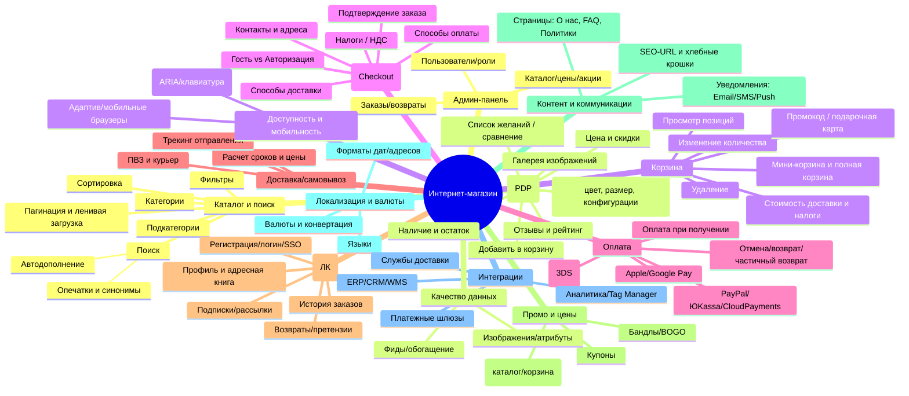

# Тестовая документация для функционального тестирования интернет-магазина

> Формат: Markdown. Содержит: Mind Map (Mermaid + список как fallback), чек-лист для Smoke-тестирования новой версии веб‑приложения, и пример матрицы прослеживаемости требований (Traceability Matrix).

---

## 1) Mind Map: функциональное тестирование интернет-магазина

### Вариант в виде диаграммы (Mermaid)

### Fallback (если Mermaid недоступен)
- Каталог и поиск: категории, подкатегории, поиск (автодополнение, опечатки/синонимы), фильтры, сортировка, пагинация/ленивая загрузка.
- Карточка товара (PDP): галерея, вариации (цвет/размер), цена/скидки, наличие, добавление в корзину, вишлист/сравнение, отзывы/рейтинг.
- Корзина: просмотр, изменение количества, удаление, промокод/подарочная карта, стоимость доставки/налоги, мини/полная корзина.
- Оформление заказа (Checkout): гость/логин, контакты/адреса, доставка, оплата, налоги/НДС, подтверждение заказа.
- Оплата: карты (3DS), Apple/Google Pay, PayPal/ЮKassa/CloudPayments, наложенный платеж, отмены/возвраты/частичные возвраты.
- Доставка/самовывоз: расчет сроков/цены, ПВЗ/курьер, трекинг.
- Личный кабинет: регистрация/логин/SSO, профиль/адреса, история заказов, возвраты, подписки/рассылки.
- Промо и цены: купоны, скидочные правила (каталог/корзина), бандлы/BOGO.
- Контент/коммуникации: страницы (О нас, FAQ, Политики), SEO‑URL/навигация, уведомления (Email/SMS/Push).
- Локализация и валюты: языки, валюты/конвертация, форматы даты/адреса.
- Интеграции: платежи, доставка, ERP/CRM/WMS, аналитика/GTM.
- Админ‑панель: каталог/цены/акции, заказы/возвраты, пользователи/роли.
- Качество данных: фиды, изображения/атрибуты.
- Доступность и мобильность: адаптив, A11y.

---

## 2) Чек‑лист для Smoke‑тестирования новой версии веб‑приложения

> Цель: быстро подтвердить, что критические пользовательские сценарии магазина работоспособны после релиза/деплоя.  
> Предусловия (рекомендуется): тестовые учетные данные (покупатель/админ), тестовые карты/песочницы платежей, хотя бы 1 товар в наличии, стабильная сеть, чистый кеш/инкогнито.

**Легенда статуса:** ☐ Не выполнено · ☑ Пройдено · ✖ Провалено · ⁝ N/A

| ID | Раздел | Проверка | Шаги (кратко) | Ожидаемый результат | Статус |
|---|---|---|---|---|---|
| SMK-001 | Доступность | Главная открывается без ошибок | Открыть главную | HTTP 200, контент грузится, без критических JS ошибок | ☐ |
| SMK-002 | Навигация | Переход в раздел каталога | Клик по главному разделу | Страница каталога отображается, фильтры видны | ☐ |
| SMK-003 | Поиск | Поиск по ключевому слову | Ввести запрос, нажать Enter | Появляются релевантные результаты, пагинация работает | ☐ |
| SMK-004 | Фильтры | Применение фильтра по цене | Задать диапазон, применить | Список обновляется, значения фильтра сохраняются | ☐ |
| SMK-005 | Сортировка | Сортировка по цене возр. | Выбрать сортировку | Товары пересортированы корректно | ☐ |
| SMK-006 | PDP | Открытие карточки товара | Клик по товару | Галерея/цена/наличие отображаются | ☐ |
| SMK-007 | PDP | Выбор вариации | Выбрать размер/цвет | Цена/наличие обновляются корректно | ☐ |
| SMK-008 | PDP→Корзина | Добавление в корзину | Нажать «В корзину» | Счетчик/мини‑корзина обновлены, товар в корзине | ☐ |
| SMK-009 | Корзина | Просмотр корзины | Открыть корзину | Позиции, суммы, доставка (если есть) считаются верно | ☐ |
| SMK-010 | Корзина | Изменение количества | Увеличить/уменьшить qty | Пересчет суммы корректный, ограничения qty соблюдены | ☐ |
| SMK-011 | Корзина | Удаление позиции | Удалить товар | Корзина пересчитана, позиция исчезла | ☐ |
| SMK-012 | Купон | Применение промокода | Ввести валидный купон | Скидка применена, отображаются новые суммы | ☐ |
| SMK-013 | Авторизация | Логин существующего пользователя | Войти из хедера/чекаута | Успешный вход, отображается имя/ЛК | ☐ |
| SMK-014 | Регистрация | Регистрация нового пользователя | Зарегистрировать email | Письмо (если нужно), вход выполнен, профиль создан | ☐ |
| SMK-015 | Checkout | Старт гостевого заказа | Из корзины → Оформление | Доступна форма гостя, без 500/JS ошибок | ☐ |
| SMK-016 | Адрес | Ввод адреса доставки | Заполнить валидные поля | Валидация проходит, расчет доставки обновлен | ☐ |
| SMK-017 | Доставка | Выбор способа доставки | Выбрать ПВЗ/курьер | Стоимость/сроки пересчитаны корректно | ☐ |
| SMK-018 | Оплата | Выбор способа оплаты | Выбрать карту/ApplePay | Метод активируется без ошибок | ☐ |
| SMK-019 | Оплата (песочница) | Успешная оплата | Ввести тест‑реквизиты | Оплата успешна, редирект на «Спасибо» | ☐ |
| SMK-020 | Заказ | Создание заказа | Завершить чек‑аут | Создан номер заказа, статус = «Новый/Оплачен» | ☐ |
| SMK-021 | Уведомления | Email о заказе | Проверить почту | Письмо с деталями заказа получено | ☐ |
| SMK-022 | ЛК | История заказов | Открыть ЛК → Заказы | Новый заказ виден со статусом/суммой | ☐ |
| SMK-023 | ЛК | Адресная книга | Добавить/редактировать адрес | Адрес сохраняется, виден в чекауте | ☐ |
| SMK-024 | Логаут | Выход из аккаунта | Нажать «Выйти» | Сессия завершена, гость | ☐ |
| SMK-025 | Админ | Вход в админ‑панель | Зайти под админом | Доступ без 500, 2FA (если есть) | ☐ |
| SMK-026 | Админ | Просмотр заказа | Найти последний заказ | Данные заказа корректны, транзакция привязана | ☐ |
| SMK-027 | Каталог (данные) | Цена/остаток обновляются | Изменить цену/остаток в админке | На витрине появляются актуальные данные | ☐ |
| SMK-028 | Мобильная версия | Критический путь в мобильном | Эмулятор/устройство: повторить SMK-006..020 | Разметка не «ломается», можно оформить заказ | ☐ |
| SMK-029 | Локализация | Переключение языка/валюты | Сменить язык/валюту | UI/цены обновляются консистентно | ☐ |
| SMK-030 | Ошибки | Страница 404/500 | Перейти к несуществующему URL | Показываются корректные системные страницы | ☐ |

> Примечание: в быстрый «дымовой» прогон обычно попадает по одному позитивному сценарию для каждого критического шага. Негативы/краевые случаи — в регрессию.

---

## 3) Пример матрицы прослеживаемости требований (RTM)

> Матрица связывает требования ↔ тест‑кейсы ↔ дефекты, помогает контролировать покрытие и влияние изменений.

| Req ID | Требование | Приоритет | Модуль | Связанные тест‑кейсы | Тип теста | Покрытие | Связанные дефекты | Комментарии |
|---|---|---|---|---|---|---|---|---|
| R-001 | Пользователь может искать товары по ключевым словам | High | Каталог/Поиск | SMK-003, FUN-101, REG-010 | Smoke, Func, Regr | Покрыто | — | Проверить автодополнение в REG-011 |
| R-002 | Доступны фильтры и сортировка в каталоге | High | Каталог | SMK-004, SMK-005, FUN-102 | Smoke, Func | Покрыто | — | Краевые значения цены в FUN-202 |
| R-003 | Карточка товара отображает цену, наличие, вариации | High | PDP | SMK-006, SMK-007, FUN-103 | Smoke, Func | Покрыто | BUG-102 (Open) | Баг с пересчетом наличия по размеру |
| R-004 | Пользователь может добавлять/удалять товары в корзину | High | Корзина | SMK-008..SMK-011, FUN-104 | Smoke, Func | Покрыто | — | Тест лимита qty в FUN-204 |
| R-005 | Применение промокода в корзине | Medium | Корзина/Промо | SMK-012, FUN-105 | Smoke, Func | Покрыто | — | Невалидные/просроченные — REG-020 |
| R-006 | Оформление заказа доступно гостю и авторизованному | High | Checkout | SMK-013..SMK-016, FUN-106 | Smoke, Func | Покрыто | — | Валидация адреса — REG-021 |
| R-007 | Выбор способа доставки с расчетом цены/сроков | High | Доставка | SMK-017, FUN-107 | Smoke, Func | Покрыто | — | Интеграция с ПВЗ — REG-022 |
| R-008 | Поддержка онлайн‑оплаты (карты, Apple/Google Pay) | High | Оплата | SMK-018..SMK-020, FUN-108 | Smoke, Func | Частично | BUG-109 (Open) | Apple Pay в Safari iOS 16 падает |
| R-009 | Создание заказа и отображение в ЛК и админке | High | Заказы/ЛК/Админ | SMK-020..SMK-022, SMK-026, FUN-109 | Smoke, Func | Покрыто | — | Сверка сумм/статусов |
| R-010 | Локализация UI и валют | Medium | Локализация | SMK-029, FUN-110 | Smoke, Func | Покрыто | — | Округление цен — REG-031 |
| R-011 | Адаптивная верстка основных страниц | Medium | Мобильная версия | SMK-028, REG-040 | Smoke, Regr | Покрыто | — | Клавиатурная навигация — REG-041 |
| R-012 | Уведомления о заказе на email | Medium | Уведомления | SMK-021, FUN-111 | Smoke, Func | Покрыто | — | Валидация DMARC — OPS |
| R-013 | Управление каталогом (цены/остатки) из админ‑панели | Medium | Админ | SMK-025, SMK-027, FUN-112 | Smoke, Func | Покрыто | — | Синхронизация с ERP ночью |
| R-014 | Возвраты/отмена заказа | Medium | Заказы/Оплата | FUN-113, REG-050 | Func, Regr | Частично | — | Частичный возврат в следующем спринте |

**Легенда:**
- `FUN-xxx` — детальные функциональные кейсы.
- `REG-xxx` — регрессионные кейсы (негатив/краевые случаи/кросс‑браузер/мобильные).
- Столбец «Покрытие» отражает наличие хотя бы одного теста на требование (и состояние известных дефектов).

---

### Примечания по использованию и адаптации
- Согласуйте уровни приоритета (High/Medium/Low) с бизнес‑сторонами.
- Для Smoke держите сценарии максимально короткими и «счастливыми путями».
- RTM поддерживайте в актуальном состоянии при любом изменении требований или интеграций.
- Добавьте столбец «Версия/билд» при необходимости трассировать покрытия по релизам.
- Рекомендуется хранить этот файл рядом с тест‑кейсами в репозитории проекта.
